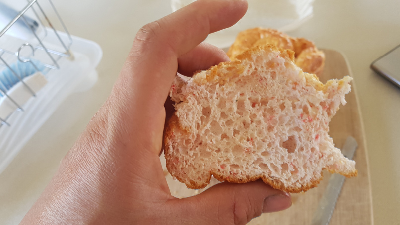
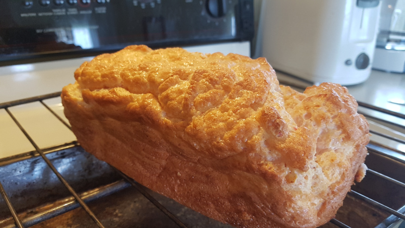
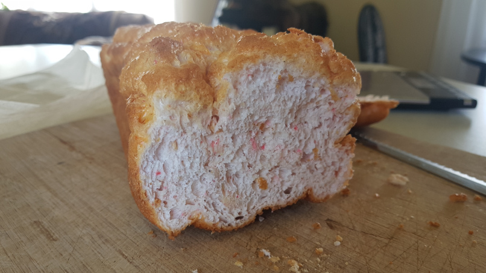

# Cloud Bread - ★★★☆☆

## Ingredients

| Name            | Quantity | Measurement | Comments                                    |
| --------------- | -------- | ----------- | ------------------------------------------- |
| Egg Whites      | 300      | Grams       |                                             |
| Cream of Tartar | 2        | Grams       |                                             |
| Psyllium Husk   | 18       | Grams       | You can use unflavored metamucil            |
| Protein Powder  | 60       | Grams       | Use a flavor type if you want a sweet bread |
| Seasonings      | Optional |             | Garlic, Onion, etc.                         |

## Instructions

1.  Preheat oven to 300 Fahrenheit
2.  In a bowl mix egg whites and cream of tartar with an electric handheld blender until stiff peaks are formed
3.  Fold in remaining ingredients
4.  Line loaf pan with parchment paper to avoid sticking
5.  Cook for 25 to 30 minutes. Avoid burning!

## Nutritional Facts

| Name     | Value |
| -------- | ----- |
| Calories |       |
| Carbs    |       |
| Fats     |       |
| Fibre    |       |
| Protein  |       |

## Pictures

