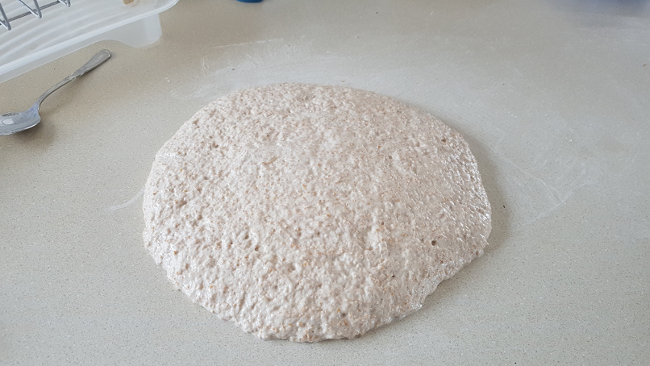
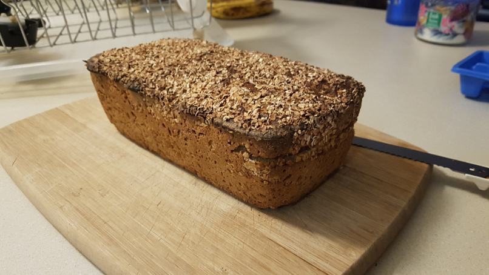
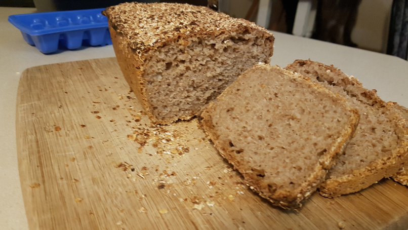

# More Awesome Than Diamonds Bread

This was inspired by /u/the_bread_code video

I used 1060 grams of aged 1:1 sourdough discard (between 1 month and 1 day old), with 125 grams of Rogers whole wheat bread flour and 15 grams of salt.

Best tasting bread I've ever had.