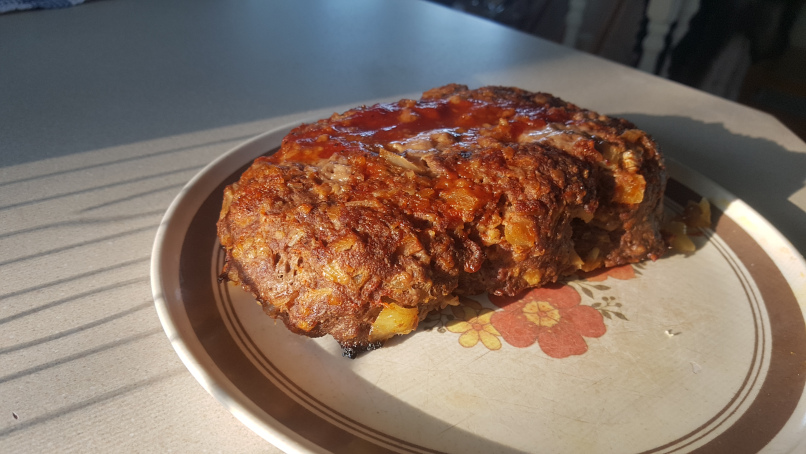

# Meatloaf - ★★★★☆

## Ingredients

| Name            | Quantity | Measurement | Comments                                    |
| --------------- | -------- | ----------- | ------------------------------------------- |
| Meat            | 500      | Grams       | Moose, Deer, Beef, Turkey, Chicken          |
| Onion           | 1        | Medium      |                                             |
| Oats            | 15       | Grams       |                                             |
| Eggs            | 1        | Medium      |                                             |
| Seasoning Salt  | 1        | Tbsp        |                                             |
| Black Pepper    | 1/2      | Tbsp        |                                             |
| Garlic Powder   | 1/2      | Tbsp        |                                             |
| Onion Soup Mix  | 15       | Grams       | Optional                                    |
| Worcestershire  | 1        | Tbsp        | Optional                                    |
| Ketchup         |          |             | Optional                                    |
| Jalapenos       |          |             | Optional                                    |

## Instructions

1.  Preheat the oven to 450f
2.  Mix all ingredients 
3.  Move ingredients into a large pan (with parchment paper on the bottom with handles)
4.  Turn oven down to 400f
5.  Bake until middle is 160-170f

## Nutritional Facts

| Name     | Value |
| -------- | ----- |
| Serving  | 1/4   |
| Calories |       |
| Carbs    |       |
| Fats     |       |
| Fibre    |       |
| Protein  |       |

## Comments

-   Remember to use a large pan for 1kg or larger meatloaves or else the loaf won’t cook evenly. The center will take much longer to get to temperature. 
-   I would have adapted this recipe from Dad. I would have added Worcestershire, Garlic Powder, and Jalapenos. Dad would have used more ketchup.
-   Use parchment paper (with handles) on the bottom of the pan so that you can easily lift the loaf out; otherwise, I end up breaking the loaf into pieces.

## Pictures

[!Picture](./picture.jpg)
