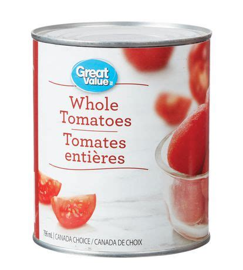

# TomatoSoup-CannedWholeTomatoes - ★★★★☆

## Ingredients

| Name                  | Quantity | Measurement | Comments                    |
| --------------------- | -------- | ----------- | --------------------------- |
| Canned Whole Tomatoes | 1        | Can         |                             |
| Chicken Bouillon      | 3        | Tsp         | Could try less if too salty |
| Garlic Powder         | 1        | Tsp         |                             |
| Onion Powder          | 1        | Tsp         |                             |
| Black Pepper          | 1        | Tsp         |                             |
| Herbs                 | 1        | Tsp         | Oregano, Basil, Etc         |

## Instructions

1.  Lightly simmer together all ingredients

## Nutritional Facts

| Name     | Value         |
| -------- | ------------- |
| Serving  | Entire Recipe |
| Calories | 125           |
| Carbs    | 25 g          |
| Fats     | 0 g           |
| Protein  | 5 g           |
| Fibre    | 5 g           |

## Comments
-   This is a great low calorie recipe that is very satiating
-   This recipe also works with Tomato Juice, but I like the seeds and pulp in the soup