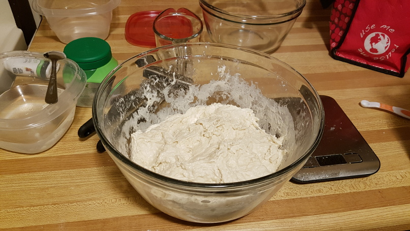
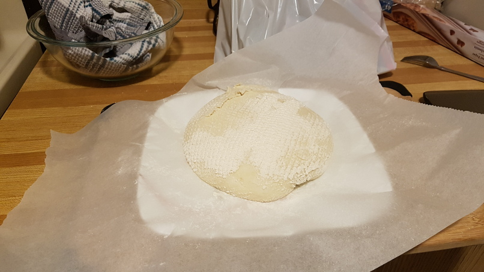
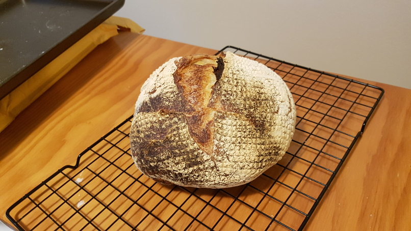
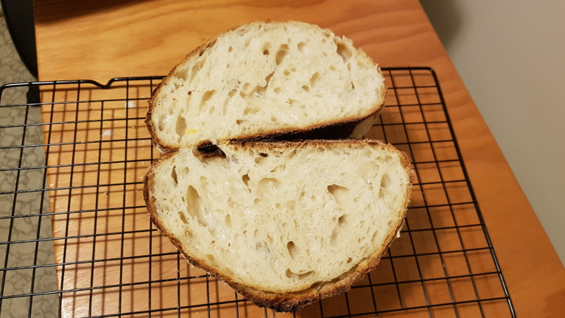

# My First Sourdough Bread

As of 2021, I cannot remember why I wanted to learn how to bake sourdough bread. It might have been from watching One Mans Wilderness by Dick Proenneke where he talks about his sourdough biscuits. But, I think it comes from before then.

With this dough I followed a recipe from thekitchn.com. In hindsight it was missing a lot of important detail, but it was a great place to start - especially for someone who hasn't baked bread before. This is the recipe that got me hooked ;) 

