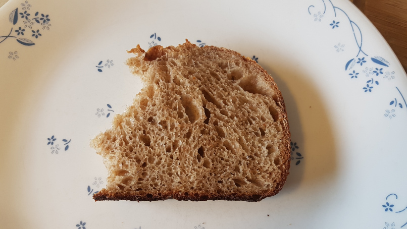
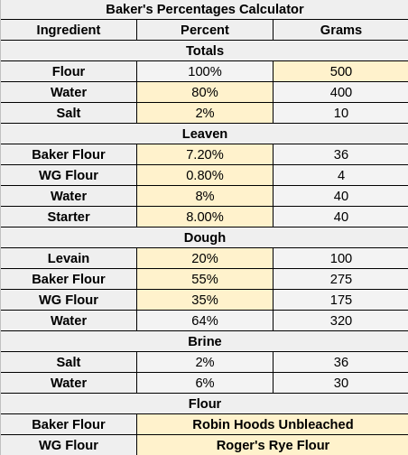
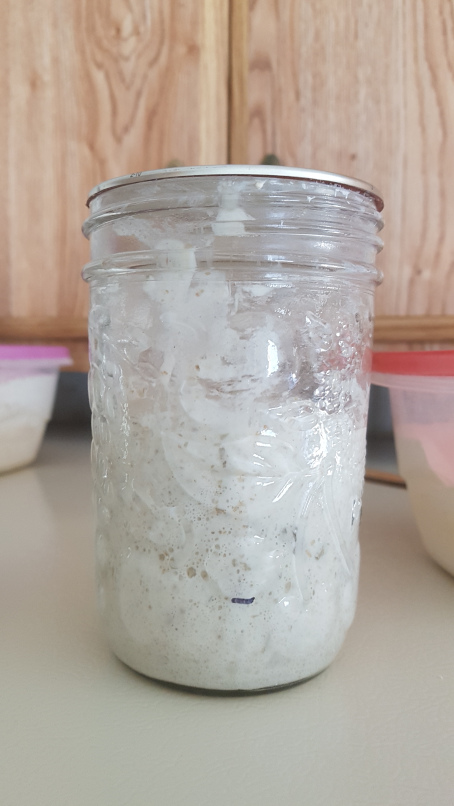
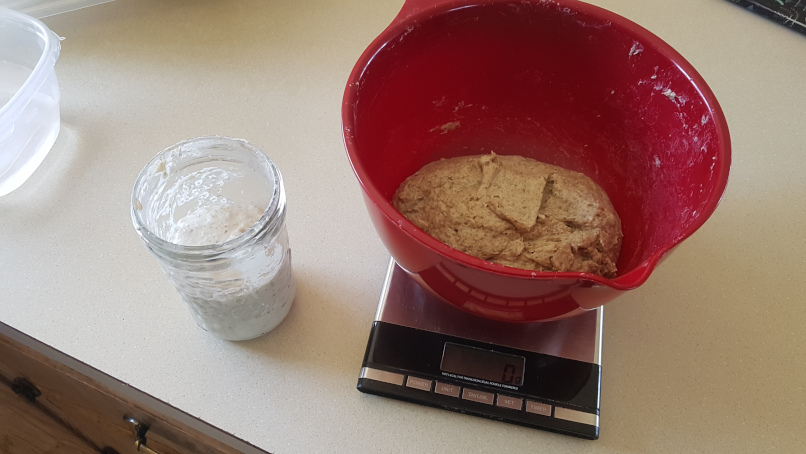
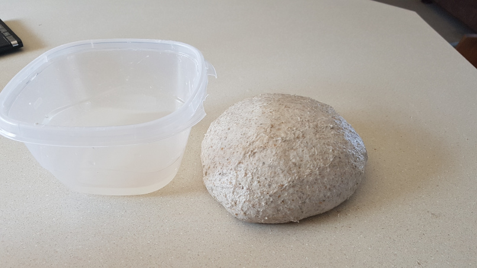
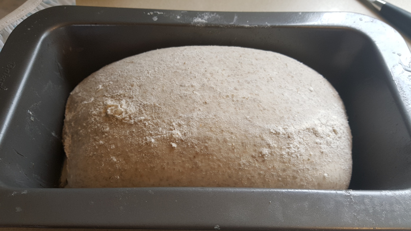
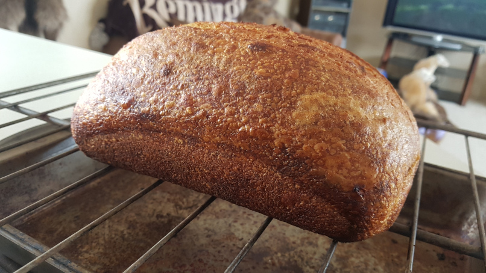
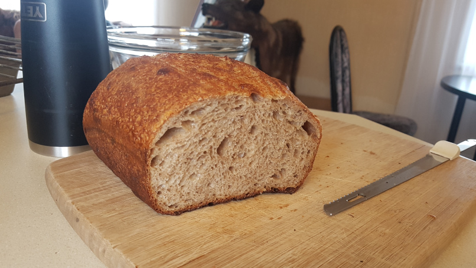

# 40% Rye Sourdough

## Ingredients

## Recipe

### General Notes

1.  I made this recipe at my parents place where the ambient temperature is usually 77 Fahrenheit. But it can vary from 75 to 80.
2.  1:1:1 means 1 part starter to flour and water. 1:10:10 means 1 part starter to 10 parts flour and water.
3.  I ferment the dough and the non-overnight starter on top of the fridge. This temperature can be anywhere from 80 to 85 Fahrenheit. My overnight starter is not stored on top of the fridge to slow down fermentation.
4.  I feed my starter once in the morning with a 1:1:1 feed before making the leaven to optimize the quickness of the fermentation in my starter. Why?
    1.  My overnight starter won't develop much power because of the low inoculation. 
    2.  The long overnight fermentation turns the starter to acid which will reduce its rise over night.
    3.  The morning starter uses a high inoculation and will hit 3x rise before peaking.
    4.  Creating the strong morning starter will help develop gas in the dough quicker, which is beneficial because the longer the dough ferments, the more it breaks down into sticky acid. 
    5.  A quick rise is beneficial when I am doing an extended autolyse (which will break the dough down too)
5.  I don't have a dutch oven or a good steam set up. I use a bread pan inside an enamel roaster. I spritz the bread with water to stop the crust from forming. This helps increase oven spring.
6.  I retard the dough in the bottom of the fridge which usually stays at or below 40 Fahrenheit.
7.  In my experiences, a higher whole grain to white flour ratio results in less rise and spring in the dough. But, a whole grain dough tastes much better and has more nutrients. I prefer whole grain.

### Starter

#### Day 1

1.  Remove Starter from the fridge and feed 1:1:1 (~0600)
2.  Wait until peaked and feed again 1:1:1 (~1200 - 1400)
3.  Overnight feed 1:5:5 (~2000)

#### Day 2

1.  Feed 1:2:2 (~0600)
2.  Wait until peaked and feed again 1:2:2 (~1200 - 1400)
3.  Overnight feed 1:10:10 (~2000)

#### Day 3 - dough day

1.  Feed 1:1:1 (~0600)

### Leaven

#### Day 3 - dough day continued - leaven

1.  Make the leaven by mixing leaven ingredients (~1000 - 1200)
2.  Autolyze dough: Mix the doughs flour + water
3.  Create salt brine by combining water and salt
4.  Wait until 3x in size or just before peaked growth (~1400 - 1600)

### Dough

#### Day 3 - dough day continued - mixing + bulk fermentation + retard

1.  After the leaven has grown 3x but just before it has peaked, add the leaven to the dough. Use the rubaud method to incorporate together.
2.  Wait 30 minutes
3.  Add brine. Use rubaud method to combine.
4.  Wait 15 minutes
5.  Use rubaud method to make more dough strength
6.  Wait 15 minutes
7.  Empty dough on the counter and do stretch and folds (North, East, West, South)    
8.  Laminate the dough from the centre outwards being careful the dough doesn't tare
9.  Cut a piece of dough off for the fermentation sample. Put the sample in a small jar, and mark it. Once it has risen by 50% then the bulk fermentation is over
10. Move dough to a square pyrex glass dish
11. Perform folds every hour when the dough needs them. The dough will need them if it flattens out and doesn't seem to be holding its self.
12. Once the fermentation sample has risen by 50%, then the bulk fermentation  is over
13. Flour the top of the dough, loosen the sides from the pyrex, and dump on counter
14. Shape the dough into a batard and move it into a dough tin
15. Cover and put in the coldest part of the fridge for 12-24 hours

### Baking

#### Day 4 - bread day

1.  Preheat the oven to 550 Fahrenheit
2.  Remove dough from fridge
3.  Score the top of the dough with a razor
4.  Thoroughly spritz the dough and enamel roaster with water
5.  Bake for 5 minutes, then spritz again. Do this 2 more times
6.  Remove bread from dough tin, and cook in the oven until desired colour (you may need to add tinfoil to the bottom of the bread to prevent the bottom from burning)

## Pictures

